<p align="center">
    <picture>
        <source media="(prefers-color-scheme: light)" srcset="docs/assets/synapse-full-logo.svg">
        
    </picture>
</p>

<p align="center">
  <strong>Build AI teams, not chatbots.</strong>
</p>

<p align="center">
  A self-hosted AI workspace for shareable teammates, shared conversations, memory,
  governed access to plugins and MCP tools, local execution, and event-driven automation.
</p>

<p align="center">
  Turn AI into a digital team with roles, memory, permissions, and working relationships.
</p>

<p align="center">
  <strong>English (US)</strong> ·
  <a href="./docs/readme/README.zh-CN.md">简体中文</a> ·
  <a href="./docs/readme/README.es.md">Español</a>
</p>

<p align="center">
  <a href="#features">Features</a> ·
  <a href="#core-model">Core Model</a> ·
  <a href="#architecture-overview">Architecture</a> ·
  <a href="#quick-start">Quick Start</a> ·
  <a href="#roadmap">Roadmap</a> ·
  <a href="./deploy.md">Deployment</a>
</p>

<p align="center">
  
</p>

> [!NOTE]
> Synapse is in an early design and implementation phase. Schemas and runtime contracts can still change quickly, and backward compatibility for old data is not guaranteed yet.

Synapse is a conversation-centric runtime for digital teammates.

Most AI products treat chat as a thin interface over an isolated bot. Synapse treats the conversation itself as the collaboration boundary: humans, platform-native actors, and bridged remote agents work in the same thread, while everything they can touch — plugins, skills, devices, sandboxes, event sources, memory — is governed at the workspace layer through explicit, revocable grants.

## Features

### Conversations are the team room

A conversation in Synapse is not a chat log in front of a bot — it is the runtime boundary. Participants, transcript visibility, actor sessions, wakeups, and memory handoff are all scoped to it, and there is no standalone, API-invoked session.

- **Four kinds of participants.** Workspace members, native actors, bridged remote agents, and external IM identities all share one thread.
- **Actors wake each other.** An actor's message lands as a durable wakeup for another actor, so multi-agent handoffs happen in the open, inside the same transcript.
- **Teammates are shareable.** Actors and remote agents can be shared like contacts — via a QR code or a friend ID, with owner approval. Cross-workspace sharing covers discovery and rosters today; conversations and execution stay inside one workspace.

<p align="center">
  
</p>

### Bring the agents you already run

A coding agent running on your laptop can join the team as a first-class participant. The machine-side daemon (`packages/remote-agent-daemon`) bridges Claude Code and Codex CLI into conversations over an outbound WebSocket. The agents keep their own runtime, tools, and model accounts.

- **Pull, not push.** The bridged agent fetches messages and posts replies through a per-conversation reverse-MCP tool surface; Synapse does not push unsolicited content to it.
- **Granted, not assumed.** Workspace plugins and runtime capabilities are projected to the remote agent through the same authorization gate that native actors use.
- **Questions come back as cards.** When the agent needs input or plan approval, a task card lands in the conversation, and any eligible participant can answer it.

<p align="center">
  
</p>

### Meet your team where it already chats

Eight IM transports — Feishu (Lark), WeChat, WeCom, DingTalk, QQ, Telegram, the WhatsApp Cloud API, and WhatsApp via the unofficial web protocol — connect external chats to the same conversation runtime, not to a separate bot system.

- **First contact binds.** An inbound chat maps one-to-one onto a Synapse conversation; the sender joins as an external participant and the configured actor is woken.
- **The same governed thread.** Everything above — actors, grants, memory, automation — applies to IM-originated conversations unchanged.
- Voice notes are transcoded on ingest; delivery status reported by IM platforms is best-effort.

<p align="center">
  
</p>

### Reach real machines

Pair your desktop, a Linux server, or a cloud Docker host, and actors can work where the work actually lives — with every call passing the authorization gate first.

- **Built-in capabilities.** Filesystem, command line, browser (Chrome DevTools), and computer use are exposed as MCP tools, granted per capability and per conversation.
- **Outbound only.** Devices dial out to the control plane; every operation travels as a signed envelope over the device's own connection.
- **A capability-aware CLI catalog.** Each device probes and advertises the CLI tools it found on that machine, so actors work from detected capabilities rather than assumptions.

<p align="center">
  
</p>

### Isolated compute, when you want it

Actors can get a session-scoped sandbox: an isolated workbench provisioned when a turn starts and destroyed when the session goes idle — while the files persist as content-addressed snapshots that other actors can pick up.

- **Three providers.** A local process, a Docker container, or an off-box E2B-compatible VM (CubeSandbox), selected per deployment.
- **Ephemeral compute, durable files.** Working sets hydrate from snapshots and commit back at the end of every turn; nothing is lost when the sandbox is torn down.

> [!NOTE]
> The sandbox runtime is opt-in via `SANDBOX_PROVIDER` and is off by default. The off-box provider requires a self-hosted CubeSandbox endpoint.

<p align="center">
  
</p>

### Every grant in one ledger

Actors, plugins, skills, runtime capabilities, memory spaces, and event sources are all managed through a single `workspace_resource_grants` ledger — explicit, revocable, and enforced uniformly across the platform.

- **Approve in chat.** A blocked sensitive call becomes a one-tap card in the conversation. Among the IM integrations, QQ supports these cards today, with more to come.
- **Consume-once approvals.** Approving replays the exact original call server-side; the model never retypes it, and the one-time grant is consumed after use.

<p align="center">
  
</p>

### Work starts without you

Schedules, custom webhooks, and GitHub/GitLab events wake conversations through the same durable session wakeups as human messages — there is no separate job system.

- **Actors schedule themselves.** An actor can schedule its own follow-up wakeup, go idle, and be brought back by the clock.
- **Events land in the thread.** Wakeups arrive as conversation-visible notices, so the team sees why an actor sprang into action.
- Register a GitHub webhook and an incident can open its own conversation with the right actors already in it.

<p align="center">
  
</p>

### Context that outlives the thread

Memory lives in permissioned memory spaces, shared through the same grants ledger as everything else; long conversations are archived verbatim rather than summarized away.

- **Remember once, recall across conversations.** Retrieval runs at every turn and combines lexical search with embeddings, so a fact saved in one conversation surfaces in later ones that share the same granted memory space.
- **Lossless context.** Older turns fold into archive chains while a live tail keeps growing — nothing is silently dropped from the record.
- Semantic recall needs an embedding provider (`EMBEDDING_PROVIDER`); without one, lexical retrieval still works.

<p align="center">
  
</p>

## Core Model

| Concept          | What it means in Synapse                                                                                          |
| ---------------- | ----------------------------------------------------------------------------------------------------------------- |
| `Workspace`      | Ownership and governance boundary for teammates, plugins, runtimes, and event sources.                            |
| `Conversation`   | Shared runtime where participants collaborate and work is persisted.                                              |
| `Actor`          | A native Synapse teammate managed by the platform.                                                                |
| `Remote agent`   | An external runtime bridged into a conversation without becoming a native actor.                                  |
| `Runtime`        | A governed execution surface — a paired device or a sandbox — whose capabilities can be granted per conversation. |
| `Resource layer` | Plugins, skills, runtime capabilities, event sources, and memory spaces, granted through one workspace ledger.    |

## Architecture Overview

Synapse uses a conversation-centric architecture. Around that core, the system separates resource runtimes, access control, memory, transport integration, and pluggable providers into distinct subsystems.

- **Conversation and session runtime.** Conversations, participants, conversation items, conversation-scoped actor sessions, and durable session wakeups define the collaboration and execution model. Model context is compiled from canonical items into shared and private archive chains plus a live tail, bounded by compaction that never rewrites history. Web chat, remote-agent bridges, and IM transports all reuse this one model.
- **Runtimes and resources.** Paired devices and sandboxes are both runtimes under one supertype, exposing grantable capabilities. Plugins, installed skills, actors, and remote agents are distinct runtime resources with independent state and lifecycle; marketplace catalog metadata is stored separately from installed state.
- **Access control.** Every resource type is authorized against a single `workspace_resource_grants` ledger, with interactive consume-once approvals for sensitive calls. Grants are explicit and revocable.
- **Memory subsystem.** Memory is organized into permissioned memory spaces shared via grants. Retrieval combines lexical indexing and embeddings to support both durable memory and thread-local working state.
- **Pluggable providers.** Embedding, OCR, document extraction, transcription, and real-time ASR resolve through env-selected providers — cloud APIs or self-hosted sidecars — and default to `none` or the built-in implementation, so the core stack runs without them.
- **Transport and automation integration.** IM transports bind external endpoints back to conversations. Event sources, schedules, webhooks, and integration triggers enter the same runtime, wake actor sessions, and emit conversation-visible events.

## Quick Start

### Local web + API

Prerequisites:

- Node.js 22 (the version used in CI)
- Docker and Docker Compose

Clone the repo and start the core local stack:

```bash
git clone --recurse-submodules https://github.com/zai-org/Synapse
cd Synapse

npm ci
./setup.sh
docker compose up -d postgres redis

# Create the current schema
npm run db:bootstrap

# Start the API and desktop web in separate terminals
npm run dev:api
npm run dev:web
```

Submodules are only needed for the device CLI catalog and connector extras — after a plain clone, `git submodule update --init` fetches them.

Open:

- Desktop web: `http://localhost:3000`
- API health: `http://localhost:3001/api/v1/health`

If your local Docker setup requires elevated privileges, run the `docker compose` command with `sudo`.

Before using actor or chat flows with real models, configure at least one platform model group: copy `packages/api/config/model-groups.yaml.example` to `packages/api/config/model-groups.yaml`, fill in the referenced `${ENV}` variables (e.g. `ANTHROPIC_API_KEY`) in `.env`, then apply it with `npm run db:rebuild` (which imports it automatically) or `npm run db:seed:model-groups`.

### Optional: reset and seed a demo environment

If you want a fully seeded local environment with demo users, a demo workspace, official actors, and built-in plugin catalog entries:

```bash
npm run db:rebuild
```

Seeded demo accounts:

- `demo@synapse.dev` / `demo1234`
- `yihang@synapse.dev` / `demo1234`

### Optional: run the Expo mobile app

The mobile client lives in its own package with its own lockfile:

```bash
cd packages/mobile-app
npm ci
npm run web
```

You can also use `npm run ios` or `npm run android` inside `packages/mobile-app`.

## What's in This Repo

- `packages/api` — Fastify API, orchestration runtime, chat, memory, files, automation, plugins, devices, and IM
- `packages/web-next` — Next.js desktop web app and workspace dashboard
- `packages/web-next-design` — backend-free design sandbox for the web UI (CI-excluded)
- `packages/mobile-app` — Expo Router mobile app and exported mobile web surface
- `packages/device-runtime` — TS device runtime: control-plane WSS client, MCP host, frp tunnel adapter, and built-in filesystem, command-line, browser, and computer-use (CUA) capabilities
- `packages/device-sdk` — REST and event SDK consumed by the dashboard and CLI
- `packages/device-protocol` — Zod schemas + enums shared by API and device runtime
- `packages/remote-agent-daemon` — machine-side daemon for bridging external runtimes such as Codex CLI or Claude Code
- `packages/shared` — shared types, protocol contracts, automation definitions, and constants
- `subprojects/cli-anything` — the HKUDS/CLI-Anything catalog, included as a git submodule. The device runtime probes each CLI's prerequisites and exposes only the tools that can actually run

The repo also contains per-platform `packages/device-runtime-bundles-*` packages, plus additional connector and tool submodules under `subprojects/`.

## Deployment

This repository currently ships with a self-hosting path centered on a single Ubuntu host and Docker Compose:

- Dockerized PostgreSQL and Redis for local infrastructure
- Dockerized API and desktop web services
- Dockerized nginx as the public TLS entrypoint
- Dockerized mobile web exported from `packages/mobile-app` and served under `/mobile/`
- Dockerized Certbot for Let's Encrypt certificates and renewal
- Optional self-hosted provider sidecars (embedding, OCR, document extraction, transcription, real-time ASR) as Compose profiles

See [`deploy.md`](deploy.md) for the production deployment path used in this repo.

## Roadmap

Roadmap items are directional and may change as the runtime model evolves.

- [ ] **Cross-workspace collaboration.** Sharing covers discovery and rosters today; planned: shared actors executing with destination-workspace grants, and conversations that span workspaces.
- [ ] **Sandbox environment profiles.** Standardized environment profiles for the sandbox runtime, including optional GUI variants and preconfigured integrations.
- [ ] **"Everything is a file" projection.** A virtual-filesystem projection for browser and computer-use runtimes — explored in an earlier prototype, not currently implemented.

## License

Synapse is released under the [Apache License 2.0](./LICENSE).
