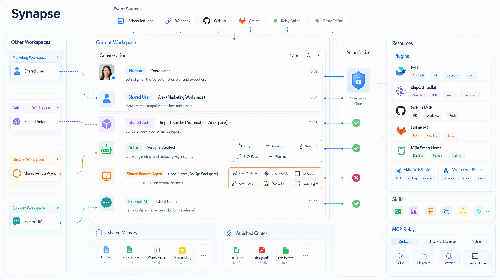

<p align="center">
    <picture>
        <source media="(prefers-color-scheme: light)" srcset="docs/assets/synapse-full-logo.svg">
        
    </picture>
</p>

<p align="center">
  <strong>不是再做一个聊天机器人，而是把 AI 组织成团队。</strong>
</p>

<p align="center">
  一个可自托管的 AI 协作工作区：支持可共享的 AI 同事、共享会话、记忆、
  对插件与 MCP 工具的受治理访问、本地执行，以及事件驱动自动化。
</p>

<p align="center">
  让 AI 成为拥有岗位、记忆、权限与协作关系的数字员工组织。
</p>

<p align="center">
  <a href="./README.md">English (US)</a> ·
  <strong>简体中文</strong> ·
  <a href="./README_ES.md">Español</a>
</p>

<p align="center">
  <a href="#为什么是-synapse">为什么是 Synapse</a> ·
  <a href="#架构概览">架构概览</a> ·
  <a href="#典型用法">典型用法</a> ·
  <a href="#路线图">路线图</a> ·
  <a href="#快速开始">快速开始</a> ·
  <a href="#仓库结构">仓库结构</a> ·
  <a href="./deploy.md">部署说明</a>
</p>

<p align="center">
  
</p>

> [!WARNING]
> Synapse 仍处于早期设计与实现阶段。Schema、运行时协议和产品表面都可能快速变化，目前不承诺兼容旧数据。

Synapse 的核心不是“再做一个会聊天的机器人”，而是“把会话本身变成协作运行时”。

在 Synapse 里，人、平台原生 Actor、以及通过桥接接入的 Remote Agent 可以在同一条会话里协作。记忆、权限、插件、设备暴露出的工具、事件源等资源归属在 Workspace 层统一治理。被共享进来的 AI 同事也不是只能旁听聊天，而是可以像联系人一样被添加、在授权后直接参与工作。

## 为什么是 Synapse

- **以会话为中心，而不是以 Bot 为中心。** 会话本身就是协作边界，参与者、可见消息、Actor 唤醒、执行上下文和记忆接力都围绕它展开。
- **AI 同事可以被共享。** Workspace 成员、Actor、Remote Agent 都可以跨 Workspace 分享，并通过联系人式关系网络被添加进来。
- **资源权限可治理。** 插件、技能、设备能力（device capability）和事件源都是 Workspace 级资源，可以显式授权、审计、回收。
- **云端协同，本地执行。** 团队在 Web 中协作，但执行可以继续落到本地浏览器、桌面、文件系统、内网服务或外部 Agent Runtime。
- **事件可以直接拉起工作。** 定时任务、自定义 Webhook、GitHub/GitLab 等集成事件都可以直接进入同一套运行时。
- **原生 Agent 与外部 Agent 并存。** 平台内的 Actor 由 Synapse 托管；Remote Agent 通过桥接接入，但保留自己的外部运行时栈。

## 核心模型

| 概念             | 在 Synapse 里的含义                                                               |
| ---------------- | --------------------------------------------------------------------------------- |
| `Workspace`      | 资源归属与治理边界，负责管理同事、插件、设备和事件源。                            |
| `Conversation`   | 真正的协作现场，参与者、消息和工作状态都沉淀在这里。                              |
| `Actor`          | 由 Synapse 原生管理的数字同事。                                                   |
| `Remote agent`   | 通过桥接加入会话的外部 Agent Runtime，不会被强行改造成平台原生 Actor。            |
| `Resource layer` | 插件、技能、设备能力（device capability）和事件源等可被授权、审计和复用的资源层。 |

## 架构概览

Synapse 采用以 conversation 为核心的分层架构，在此基础上将资源运行时、权限控制、记忆、外部传输接入和上下文管理分别建模。

- **会话与 session 运行时。** `conversation`、participants、conversation items、conversation 范围内的 actor sessions、`session_wakeups` 共同定义协作与执行模型。每个 actor session 都绑定到一个 conversation，没有脱离 conversation 的独立 API 调用 session。Web chat、remote-agent bridge、IM transport 都复用这一模型，而不是各自实现独立聊天体系。
- **资源运行时。** 插件、已安装技能、设备 exposures、actors、remote agents 都作为独立 runtime resource 建模，拥有各自的状态、生命周期和 API。Marketplace catalog 与安装后的 runtime state 分离存储。
- **权限控制。** 授权基于显式资源类型进行判定，包括 `workspace`、`conversation`、`actor`、`remote_agent`、`plugin_installation`、`installed_skill`、`device_capability`、`memory_item` 等，因此共享、调用和治理可以落到同一套访问模型上。
- **记忆子系统。** Memory 按作用域划分为 `workspace_shared`、`conversation_shared`、`actor_private`、`participant_private`、`user_private`。召回同时结合 lexical indexing 与 embeddings，以支持长期记忆和线程内工作记忆。
- **传输与自动化接入。** IM transport 将外部 endpoint 重新绑定回 conversation。事件源、定时任务、Webhook 和集成触发器也通过同一运行时进入系统，用于唤醒该 conversation 中的 actor 运行时并生成会话可见事件。
- **上下文窗口管理。** 模型上下文由 canonical context items 编译为 shared/private archive chains 与实时 tail window。archive points、compaction runs 与 per-event context policies 共同控制 prompt 大小，同时保留作用域和事件语义。

## 典型用法

- 把一个研究型 Actor 分享到另一个 Workspace，授予需要的插件后，直接进入同一条会话协作。
- 配对桌面设备（device），让团队在保留权限边界的前提下使用浏览器、文件系统和命令行能力。
- 注册 GitHub、GitLab 或自定义 Webhook 事件源，在事故或任务发生时自动拉起对应会话和角色。
- 将另一台机器上的 Coding Agent 以 Remote Agent 的方式桥接进 Synapse，让它参与协作，同时保留自身工具链与运行时。

## 探索性功能

本节介绍的是已经在代码中开始验证、但还不应视为稳定平台契约的运行时方向。

### Everything is a file model

Synapse 正在探索一种面向部分本地 runtime 的虚拟文件系统投影模型，把状态、结构与动作统一表达为路径、文件和可写控制节点。这一方向既符合平台自身的授权与范围控制模型，也契合模型对命令行工作流的强先验，使复杂过程更容易通过组合、管道和串联来表达，并减少执行轮次。

当前已实现的部分包括：

- **按 session 暴露的 VFS 能力面。** 设备运行时（device runtime）已将 builtin browser 与 builtin CUA runtime 投影到 session 路径下，并提供基于文件的 session 创建、查看与关闭控制。
- **浏览器投影。** 浏览器能力面当前已覆盖页面状态、页面列表、当前页面快照与截图、树形投影与节点级文件，以及基于文件写入的导航与交互动作入口。
- **CUA 投影。** CUA 能力面当前已覆盖显示器、窗口、应用、截图、键盘状态、焦点元素摘要，以及在桌面语义后端可用时的无障碍语义树。
- **动作文件。** 可写节点已经映射到具体 runtime 动作。浏览器侧包括 `navigate`、`new_page`、`select_page`、`click`、`fill`、`press_key`、`evaluate`；CUA 侧包括 `click`、`type_text`、`press_keys`、`scroll`，并在节点具备可操作边界时提供按节点触发的语义动作。

## 路线图

路线图条目描述的是计划中的平台能力，属于方向性规划，后续可能会随着运行时模型演进而调整。

### 计划中的 Sandbox 执行环境

引入一层受治理的 Sandbox 执行环境，作为 Agent 的平台原生执行面。

规划目标：

- 将隔离执行环境建模为 Workspace 可治理资源，而不是让 Agent 直接操作宿主环境。
- 支持暂停、恢复与状态持久化，使 Agent 能跨多次运行延续工作状态。
- 提供标准化环境配置，可选 GUI，并支持预配置工具与集成。
- 同时支持云端托管与本地托管两种部署形态。
- 在符合 Synapse 会话、资源与授权模型的前提下，评估兼容 E2B 风格的控制接口。

该能力尚处于规划阶段，并非当前已交付功能。

## 快速开始

### 本地启动 Web 和 API

前置条件：

- Node.js
- Docker 与 Docker Compose

克隆仓库并启动本地基础环境：

```bash
git clone https://github.com/zai-org/Synapse
cd Synapse

npm ci
./setup.sh
docker compose up -d postgres redis

# 创建当前版本数据库结构
npm run db:bootstrap

# 分别在两个终端启动 API 和桌面 Web
npm run dev:api
npm run dev:web
```

启动后可访问：

- 桌面 Web：`http://localhost:3000`
- API 健康检查：`http://localhost:3001/api/v1/health`

如果你本机的 Docker 需要更高权限，请把上面的 `docker compose` 命令改成 `sudo docker compose`。

如果希望让 Actor 和聊天真正调用模型，请先配置至少一个 platform 模型组：把 `packages/api/config/model-groups.yaml.example` 复制为 `packages/api/config/model-groups.yaml`，在根目录 `.env` 中填好其中引用的 `${ENV}` 变量（如 `ANTHROPIC_API_KEY`），然后运行 `npm run db:rebuild`（会自动导入）或单独运行 `npm run db:seed:model-groups`。

### 可选：重建并写入演示数据

如果你想要一个带演示账号、演示 Workspace、官方 Actor 和内置插件目录的本地环境：

```bash
npm run db:rebuild
```

默认演示账号：

- `demo@synapse.dev` / `demo1234`
- `yihang@synapse.dev` / `demo1234`

### 可选：运行 Expo Mobile App

移动端位于独立包中，并维护自己的锁文件：

```bash
cd packages/mobile-app
npm ci
npm run web
```

在 `packages/mobile-app` 下也可以使用 `npm run ios` 或 `npm run android`。

## 仓库结构

- `packages/api`：Fastify API，以及编排、聊天、记忆、文件、自动化、插件、设备（devices）、IM、审计等运行时模块
- `packages/web-next`：Next.js 桌面端 Web 与 Workspace 控制台
- `packages/mobile-app`：Expo Router 移动端应用，以及导出的 mobile web 表面
- `packages/device-runtime`：TS 设备运行时，包含 Control Plane WSS 客户端、MCP 主机、frp tunnel 适配器、内置 filesystem/commandline/browser/CUA exposures
- `packages/device-sdk`：被控制台与 CLI 使用的 REST/事件 SDK
- `packages/device-protocol`：API 与设备运行时共享的 Zod schemas 与枚举
- `packages/remote-agent-daemon`：运行在机器侧的守护进程，用来桥接 Codex CLI、Claude Code 等外部 Runtime
- `packages/shared`：共享类型、协议定义、自动化枚举与常量
- `subprojects/cli-anything`：作为子模块引入的 HKUDS/CLI-Anything 目录；device-runtime 的 `cli-catalog` builtin 探测各 CLI 的前置依赖，仅将可运行者通过命令行 builtin 暴露（见 `docs/cli-anything-integration-redesign-plan.md`）

## 部署

当前仓库提供的是一条面向单机 Ubuntu 主机、以 Docker Compose 为核心的自托管路径：

- PostgreSQL 与 Redis 通过 Docker 运行
- API 与桌面 Web 通过 Docker 容器运行
- Dockerized nginx 作为公网 TLS 入口
- mobile web 由 `packages/mobile-app` 静态导出，并通过容器化 nginx 挂在 `/mobile/`
- Let's Encrypt 证书与续期由 Dockerized Certbot 管理

生产部署路径见 [`deploy.md`](deploy.md)。
