<p align="center">
    <picture>
        <source media="(prefers-color-scheme: light)" srcset="../assets/synapse-full-logo.svg">
        
    </picture>
</p>

<p align="center">
  <strong>Crea equipos de IA, no solo chatbots.</strong>
</p>

<p align="center">
  Un espacio de trabajo de IA autoalojado: compañeros de IA que se pueden compartir, conversaciones y memoria comunes,
  acceso gobernado a plugins y herramientas MCP, ejecución local y automatización por eventos.
</p>

<p align="center">
  Convierte la IA en un equipo digital con roles, memoria, permisos y relaciones de trabajo.
</p>

<p align="center">
  <a href="../../README.md">English (US)</a> ·
  <a href="./README.zh-CN.md">简体中文</a> ·
  <strong>Español</strong>
</p>

<p align="center">
  <a href="#características">Características</a> ·
  <a href="#modelo-base">Modelo base</a> ·
  <a href="#resumen-de-arquitectura">Arquitectura</a> ·
  <a href="#inicio-rápido">Inicio rápido</a> ·
  <a href="#hoja-de-ruta">Hoja de ruta</a> ·
  <a href="../../deploy.md">Despliegue</a>
</p>

<p align="center">
  
</p>

> [!NOTE]
> Synapse está en una fase temprana de diseño e implementación. El esquema de datos y los contratos del runtime pueden cambiar con rapidez, y por ahora no se garantiza compatibilidad con datos antiguos.

Synapse es un runtime centrado en la conversación, pensado para compañeros de trabajo digitales.

La mayoría de los productos de IA tratan el chat como una simple interfaz sobre un bot aislado. Synapse convierte la conversación en el verdadero límite de colaboración: personas, Actors nativos de la plataforma y Remote Agents externos trabajan en el mismo hilo, y todos los recursos que pueden usar — plugins, skills, dispositivos, sandboxes, fuentes de eventos, memoria — se gobiernan a nivel de Workspace mediante permisos explícitos y revocables.

## Características

### La conversación es el espacio de trabajo del equipo

En Synapse una conversación no es el historial de un bot: es el límite del runtime. Los participantes, la visibilidad del historial, las sesiones de los Actors, las activaciones y la continuidad de la memoria tienen la conversación como ámbito, y no existen sesiones sueltas que se invoquen por API.

- **Cuatro tipos de participantes.** Miembros del Workspace, Actors nativos, Remote Agents externos e identidades de mensajería comparten el mismo hilo.
- **Los Actors se despiertan entre sí.** El mensaje de un Actor activa de forma duradera a otro, así que los relevos entre agentes ocurren a la vista de todos, en la misma conversación.
- **Compañeros de IA que puedes compartir.** Los Actors y los Remote Agents se comparten como si añadieras un contacto — con un código QR o un ID de amigo, y la aprobación de su propietario. Hoy, compartir entre Workspaces cubre el descubrimiento y la lista de contactos; las conversaciones y la ejecución permanecen dentro de cada Workspace.

<p align="center">
  
</p>

### Trae los agentes que ya usas

Un agente de programación que se ejecuta en tu portátil puede unirse al equipo como un participante más. Un daemon que se ejecuta en tu máquina (`packages/remote-agent-daemon`) conecta Claude Code y Codex CLI a las conversaciones mediante un WebSocket saliente; cada agente conserva su propio runtime, sus herramientas y su cuenta de modelo.

- **Modelo pull, no push.** El agente recupera los mensajes y publica sus respuestas con un conjunto de herramientas reverse-MCP propio de cada conversación; Synapse nunca le envía contenido que no haya pedido.
- **Acceso concedido, nunca implícito.** Los plugins y capacidades de runtime del Workspace se le exponen a través de la misma puerta de autorización que usan los Actors nativos.
- **Las preguntas vuelven como tarjetas.** Si el agente necesita más información o la aprobación de un plan, aparece una tarjeta en la conversación y cualquier participante con permisos puede responderla.

<p align="center">
  
</p>

### Donde tu equipo ya conversa

Ocho conectores de mensajería — Feishu (Lark), WeChat, WeCom, DingTalk, QQ, Telegram, la WhatsApp Cloud API y WhatsApp mediante el protocolo web no oficial — llevan los chats externos al mismo runtime de conversaciones, sin montar un sistema de bots aparte.

- **El primer contacto crea el vínculo.** Cada chat entrante se asocia uno a uno con una conversación de Synapse; quien escribe se incorpora como participante externo y el Actor configurado se pone en marcha.
- **El mismo hilo gobernado.** Todo lo anterior — Actors, permisos, memoria, automatización — se aplica igual a las conversaciones que nacen en la mensajería.
- Las notas de voz se transcodifican al entrar. Las plataformas de mensajería informan el estado de entrega en la medida de lo posible, sin garantías.

<p align="center">
  
</p>

### Ejecuta en tus propias máquinas

Empareja tu equipo de escritorio, un servidor Linux o un host Docker en la nube, y los Actors podrán trabajar directamente en los sistemas donde están el código, los archivos y los servicios — y cada llamada pasa primero por la puerta de autorización.

- **Capacidades integradas.** Sistema de archivos, línea de comandos, navegador (Chrome DevTools) y control del equipo (computer use) se exponen como herramientas MCP, concedidas capacidad por capacidad y conversación por conversación.
- **Solo conexiones salientes.** Es el dispositivo el que inicia la conexión con el plano de control, y cada operación viaja firmada a través de esa misma conexión.
- **Catálogo de herramientas CLI detectadas.** Cada dispositivo comprueba y anuncia las herramientas CLI disponibles en esa máquina, así los Actors trabajan con capacidades detectadas y no con suposiciones.

<p align="center">
  
</p>

### Cómputo aislado, solo si lo activas

Los Actors pueden trabajar en un sandbox ligado a la sesión: un entorno aislado que se crea al empezar el turno y se destruye cuando la sesión queda inactiva, mientras los archivos persisten como snapshots con direccionamiento por contenido que otros Actors pueden retomar.

- **Tres proveedores.** Un proceso local, un contenedor Docker o una máquina virtual externa compatible con E2B (CubeSandbox); se elige uno por despliegue.
- **Cómputo efímero, archivos duraderos.** Los archivos de trabajo se restauran desde los snapshots y se guardan al final de cada turno; al destruir el sandbox no se pierde nada.

> [!NOTE]
> El runtime de sandbox se activa con `SANDBOX_PROVIDER` y viene desactivado por defecto. El proveedor externo requiere un endpoint de CubeSandbox autoalojado.

<p align="center">
  
</p>

### Todas las concesiones en un solo registro

Actors, plugins, skills, capacidades de runtime, espacios de memoria y fuentes de eventos se gestionan en un único registro de permisos, `workspace_resource_grants` — explícito, revocable y aplicado de manera uniforme en toda la plataforma.

- **Aprueba desde el chat.** Una llamada sensible bloqueada se convierte en una tarjeta que se aprueba con un toque dentro de la conversación; en mensajería, hoy solo QQ muestra estas tarjetas, y llegarán más plataformas.
- **Aprobaciones de un solo uso.** Al aprobar, el servidor repite exactamente la llamada original; el modelo no vuelve a introducirla, y la concesión se consume tras usarse.

<p align="center">
  
</p>

### El trabajo empieza solo

Las tareas programadas, los webhooks personalizados y los eventos de GitHub/GitLab despiertan conversaciones con las mismas activaciones duraderas de sesión que los mensajes humanos — no hay un sistema de tareas aparte.

- **Los Actors se ponen su propia alarma.** Un Actor puede dejar programada su siguiente activación, quedar inactivo y volver al trabajo cuando llegue la hora.
- **Los eventos aterrizan en el hilo.** Las activaciones llegan como avisos visibles en la conversación, así el equipo entiende por qué un Actor se puso en marcha.
- Registra un webhook de GitHub y un incidente podrá abrir su propia conversación con los Actors adecuados ya dentro.

<p align="center">
  
</p>

### Contexto que sobrevive al hilo

La memoria se guarda en espacios de memoria con permisos, compartidos mediante el mismo registro de concesiones que el resto de recursos; las conversaciones largas se archivan tal cual, en lugar de perderse en resúmenes.

- **Recuperación entre conversaciones.** La búsqueda se ejecuta en cada turno y combina búsqueda léxica con embeddings, así que un dato guardado en una conversación reaparece en las siguientes que comparten el mismo espacio de memoria.
- **Contexto sin pérdidas.** Los turnos antiguos se compactan en cadenas de archivado mientras el segmento activo sigue creciendo — nada se descarta en silencio.
- La búsqueda semántica requiere un proveedor de embeddings (`EMBEDDING_PROVIDER`); sin él, la búsqueda léxica sigue funcionando.

<p align="center">
  
</p>

## Modelo base

| Concepto         | Qué significa en Synapse                                                                                                             |
| ---------------- | ------------------------------------------------------------------------------------------------------------------------------------ |
| `Workspace`      | Frontera de propiedad y gobernanza para compañeros de IA, plugins, runtimes y fuentes de eventos.                                    |
| `Conversation`   | El espacio compartido donde colaboran los participantes y donde el trabajo queda guardado.                                           |
| `Actor`          | Un compañero digital administrado de forma nativa por Synapse.                                                                       |
| `Remote agent`   | Un runtime externo que participa en una conversación sin convertirse en Actor nativo.                                                |
| `Runtime`        | Un entorno de ejecución gobernado — un dispositivo emparejado o un sandbox — cuyas capacidades se conceden por conversación.         |
| `Resource layer` | Plugins, skills, capacidades de runtime, fuentes de eventos y espacios de memoria, concedidos desde un único registro del Workspace. |

## Resumen de arquitectura

Synapse adopta una arquitectura centrada en la conversación. Sobre ese núcleo, el sistema separa en subsistemas propios los runtimes de recursos, el control de acceso, la memoria, la integración de mensajería y los proveedores conectables.

- **Runtime de conversación y sesión.** Conversaciones, participantes, elementos de conversación, sesiones de Actor con ámbito de conversación y activaciones duraderas de sesión definen el modelo de colaboración y ejecución. El contexto del modelo se compila a partir de elementos canónicos en cadenas de archivado compartidas y privadas más un segmento activo, acotado por una compactación de archivo que nunca reescribe el historial. La web, los puentes de Remote Agents y los conectores de mensajería reutilizan este único modelo.
- **Runtimes y recursos.** Los dispositivos emparejados y los sandboxes son runtimes bajo un mismo supertipo, y exponen capacidades que se pueden conceder. Plugins, skills instaladas, Actors y Remote Agents son recursos de runtime independientes, con estado y ciclo de vida propios; el catálogo del marketplace se guarda separado del estado de lo instalado.
- **Control de acceso.** Cada tipo de recurso se gestiona en un único registro `workspace_resource_grants`, con aprobaciones interactivas de un solo uso para las llamadas sensibles. Las concesiones son explícitas y revocables.
- **Subsistema de memoria.** La memoria se organiza en espacios con permisos que se comparten mediante concesiones. La búsqueda combina indexación léxica y embeddings, y cubre tanto la memoria duradera como el estado de trabajo de cada hilo.
- **Proveedores conectables.** Embeddings, OCR, extracción de documentos, transcripción y reconocimiento de voz en tiempo real se resuelven con proveedores que se eligen por variables de entorno — APIs en la nube o sidecars autoalojados — y por defecto usan el proveedor `none` o la implementación integrada, de modo que el núcleo funciona sin ellos.
- **Integración de mensajería y automatización.** Los conectores de mensajería vinculan los endpoints externos con las conversaciones. Fuentes de eventos, tareas programadas, webhooks y disparadores de integraciones entran por el mismo runtime, despiertan sesiones de Actor y producen eventos visibles en la conversación.

## Inicio rápido

### Web local + API

Requisitos previos:

- Node.js 22 (la versión que usa la CI)
- Docker y Docker Compose

Clona el repositorio y levanta el entorno local básico:

```bash
git clone --recurse-submodules https://github.com/zai-org/Synapse
cd Synapse

npm ci
./setup.sh
docker compose up -d postgres redis

# Crea el esquema actual
npm run db:bootstrap

# Inicia la API y la web de escritorio en terminales separadas
npm run dev:api
npm run dev:web
```

Los submódulos solo hacen falta para el catálogo de CLI del dispositivo y algunos extras de conectores; si hiciste un clon normal, ejecuta después `git submodule update --init`.

Luego abre:

- Web de escritorio: `http://localhost:3000`
- Comprobación de salud de la API: `http://localhost:3001/api/v1/health`

Si tu Docker local requiere privilegios elevados, ejecuta `docker compose` con `sudo`.

Para que los Actors y el chat usen modelos reales, configura al menos un grupo de modelos de plataforma: copia `packages/api/config/model-groups.yaml.example` a `packages/api/config/model-groups.yaml`, completa en `.env` las variables `${ENV}` referenciadas (p. ej. `ANTHROPIC_API_KEY`) y aplícalo con `npm run db:rebuild` (que lo importa automáticamente) o con `npm run db:seed:model-groups`.

### Opcional: restablecer y cargar un entorno de demostración

Si quieres un entorno local con usuarios de demostración, un Workspace inicial, Actors oficiales y el catálogo de plugins integrado:

```bash
npm run db:rebuild
```

Cuentas de demostración creadas por defecto:

- `demo@synapse.dev` / `demo1234`
- `yihang@synapse.dev` / `demo1234`

### Opcional: ejecutar la app móvil con Expo

La app móvil está en su propio paquete y mantiene su propio lockfile:

```bash
cd packages/mobile-app
npm ci
npm run web
```

Dentro de `packages/mobile-app` también puedes usar `npm run ios` o `npm run android`.

## Qué incluye este repositorio

- `packages/api`: API con Fastify y el runtime de orquestación, chat, memoria, archivos, automatización, plugins, dispositivos y mensajería
- `packages/web-next`: aplicación web de escritorio en Next.js y panel del Workspace
- `packages/web-next-design`: entorno de diseño de la web sin backend (excluido de la CI)
- `packages/mobile-app`: app móvil con Expo Router y versión web móvil exportable
- `packages/device-runtime`: runtime del dispositivo en TypeScript, con cliente WSS del plano de control, host MCP, adaptador de túnel frp y capacidades integradas de sistema de archivos, línea de comandos, navegador y control del equipo (computer use, CUA)
- `packages/device-sdk`: SDK de REST y eventos que consumen el panel y la CLI
- `packages/device-protocol`: esquemas de Zod y enums compartidos entre la API y el runtime del dispositivo
- `packages/remote-agent-daemon`: daemon que se ejecuta en la máquina del usuario para conectar runtimes externos como Codex CLI o Claude Code
- `packages/shared`: tipos compartidos, esquemas de protocolo, definiciones de automatización y constantes
- `subprojects/cli-anything`: el catálogo HKUDS/CLI-Anything, incluido como submódulo de git. El runtime del dispositivo comprueba los requisitos de cada CLI y expone solo las herramientas que de verdad se pueden ejecutar

El repositorio también contiene paquetes `packages/device-runtime-bundles-*` por plataforma, además de otros submódulos de conectores y herramientas bajo `subprojects/`.

## Despliegue

Hoy el repositorio ofrece una opción de autoalojamiento basada en Docker Compose para una sola máquina Ubuntu:

- PostgreSQL y Redis en Docker
- API y web de escritorio en contenedores Docker
- nginx en Docker como punto de entrada TLS público
- Web móvil exportada desde `packages/mobile-app` y servida bajo `/mobile/`
- Certbot en Docker para los certificados de Let's Encrypt y su renovación
- Sidecars de proveedores autoalojados opcionales (embeddings, OCR, extracción de documentos, transcripción, reconocimiento de voz en tiempo real) como perfiles de Compose

Consulta [`deploy.md`](../../deploy.md) para el flujo de despliegue en producción que usa este repositorio.

## Hoja de ruta

Los elementos de la hoja de ruta son orientativos y pueden ajustarse a medida que evoluciona el modelo del runtime.

- [ ] **Colaboración entre Workspaces.** Hoy compartir cubre el descubrimiento y la lista de contactos; lo previsto es que los Actors compartidos puedan ejecutarse con las concesiones del Workspace de destino, y que existan conversaciones entre Workspaces.
- [ ] **Perfiles de entorno para el sandbox.** Perfiles de entorno estandarizados para el runtime de sandbox, con variantes opcionales con GUI e integraciones preconfiguradas.
- [ ] **Proyección "everything is a file".** Una proyección de sistema de archivos virtual para los runtimes de navegador y computer use — se exploró en un prototipo anterior y hoy no está implementada.

## Licencia

Synapse se distribuye bajo la [Licencia Apache 2.0](../../LICENSE).
