<p align="center">
    <picture>
        <source media="(prefers-color-scheme: light)" srcset="../assets/synapse-full-logo.svg">
        
    </picture>
</p>

<p align="center">
  <strong>不是再做一个聊天机器人，而是把 AI 组织成团队。</strong>
</p>

<p align="center">
  一个可自托管的 AI 协作工作区：AI 同事可以共享，会话与记忆可以沉淀，插件与 MCP 工具的访问统一治理，并支持本地执行与事件驱动自动化。
</p>

<p align="center">
  把 AI 组织成一支拥有岗位、记忆、权限与协作关系的数字员工团队。
</p>

<p align="center">
  <a href="../../README.md">English (US)</a> ·
  <strong>简体中文</strong> ·
  <a href="./README.es.md">Español</a>
</p>

<p align="center">
  <a href="#功能特性">功能特性</a> ·
  <a href="#核心模型">核心模型</a> ·
  <a href="#架构概览">架构概览</a> ·
  <a href="#快速开始">快速开始</a> ·
  <a href="#路线图">路线图</a> ·
  <a href="../../deploy.md">部署说明</a>
</p>

<p align="center">
  
</p>

> [!NOTE]
> Synapse 仍处于早期设计与实现阶段。Schema 和运行时协议可能快速变化，目前不承诺兼容旧数据。

Synapse 的核心不是“再做一个会聊天的机器人”，而是“把会话本身变成协作运行时”。

大多数 AI 产品把聊天当作单个 Bot 的界面外壳。Synapse 把会话本身当作协作边界：人、平台原生 Actor、桥接进来的 Remote Agent 在同一条会话里工作；它们可以使用的全部资源——插件、技能、设备、沙箱、事件源、记忆——都在 Workspace 层通过显式、可回收的授权统一治理。

## 功能特性

### 会话就是团队的工作现场

在 Synapse 里，会话不只是一份聊天记录，而是运行时边界本身。参与者、消息可见性、Actor session（Actor 在会话中的运行实例）、唤醒和记忆接力都以会话为作用域，不存在脱离会话、由 API 单独拉起的 session。

- **四类参与者。** Workspace 成员、原生 Actor、桥接的 Remote Agent 和来自外部 IM 的身份，在同一条会话里协作。
- **Actor 之间互相唤醒。** 一个 Actor 的发言会作为持久化唤醒送达另一个 Actor，多 Agent 之间的交接公开可见，并全部沉淀在同一份会话记录里。
- **AI 同事可以被分享。** Actor 和 Remote Agent 像加好友一样分享出去——扫二维码或搜好友 ID，由归属方审批。跨 Workspace 的分享目前限于发现和联系人列表；会话和执行仍在单个 Workspace 内完成。

<p align="center">
  
</p>

### 把你手上的 Agent 直接带进来

跑在你笔记本上的 Coding Agent 可以作为一等参与者加入团队。机器侧守护进程（`packages/remote-agent-daemon`）通过出站 WebSocket 把 Claude Code、Codex CLI 桥接进会话——它们保留自己的运行时、工具链和模型账号。

- **拉取，而不是推送。** 桥接的 Agent 通过每条会话专属的一组 MCP 工具主动拉取消息、发回回复；Synapse 不会擅自把内容推给它。
- **授予，而不是默认拥有。** Workspace 的插件和运行时能力经由与原生 Actor 相同的授权门投影给 Remote Agent。
- **提问会变成卡片回到会话。** Agent 需要输入或方案确认时，一张任务卡片落进会话，任何有资格的参与者都能作答。

<p align="center">
  
</p>

### 接入团队常用的 IM

八种 IM 接入——飞书、微信、企业微信、钉钉、QQ、Telegram、WhatsApp 官方云 API 以及基于网页协议的非官方 WhatsApp——把外部聊天接进同一套会话运行时，而不是另起一套 Bot 体系。

- **首次联系即绑定。** 一个外部聊天与一条 Synapse 会话一一对应；发消息的人以外部参与者身份加入，配置好的 Actor 随即被唤醒。
- **同一条纳入统一治理的会话。** 上面讲到的一切——Actor、授权、记忆、自动化——对来自 IM 的会话同样生效，没有特例。
- 语音消息在接入时自动转码；IM 平台侧的送达状态仅尽力上报，不作保证。

<p align="center">
  
</p>

### 直达你的真实设备

配对你的桌面电脑、Linux 服务器或云上的 Docker 主机，让 Actor 在工作实际发生的环境里执行——每一次调用都先经过授权门。

- **内置能力面。** 文件系统、命令行、浏览器（Chrome DevTools）、桌面操作以 MCP 工具的形式暴露，按能力、按会话逐项授权。
- **只出不进。** 设备主动向控制面发起连接；每个操作都以签名封套的形式，经由设备自身的连接下发。
- **动态探测生成的 CLI 能力清单。** 每台设备只上报本机真正可运行的 CLI 工具，Actor 看到的始终是实际可用的能力。

<p align="center">
  
</p>

### 需要时才开启的隔离算力

Actor 可以获得一个以 session 为生命周期的沙箱：回合开始时拉起、每回合结束时提交、session 空闲时销毁——文件则以内容寻址快照的形式留存，其他获得授权的 Actor 可以继续使用。

- **三种运行后端。** 本机进程、Docker 容器，或者离机的 E2B 兼容虚拟机（CubeSandbox），按部署选定其一。
- **算力即用即毁，文件长期留存。** 工作集从快照恢复，每回合结束时提交回去；销毁沙箱不会丢失任何文件。

> [!NOTE]
> 沙箱运行时通过 `SANDBOX_PROVIDER` 显式开启，默认关闭。离机方案需要自托管的 CubeSandbox 服务端。

<p align="center">
  
</p>

### 所有授权，一本账

Actor、插件、技能、运行时能力（runtime capability）、记忆空间、事件源的授权，统一记录在同一张 `workspace_resource_grants` 账本中，显式、可回收，并在整个平台统一生效；敏感调用在这本账之上还要经过会话内的交互审批。

- **在聊天里审批。** 被拦下的敏感调用会变成会话里的一张卡片，点一下即可放行（QQ 端同步显示，更多平台在路上）。
- **一次性授权。** 审批后由服务端原样重放最初那次调用；模型不会重新输入命令，一次性授权在使用后即失效。

<p align="center">
  
</p>

### 事件也能触发工作

定时任务、自定义 Webhook、GitHub/GitLab 事件通过与人类消息完全相同的持久化 session 唤醒机制唤醒会话——没有独立的任务系统。

- **Actor 会给自己定闹钟。** Actor 可以给自己安排后续唤醒，先转入空闲，到点后被重新唤醒、继续处理。
- **事件落在会话里。** 唤醒以会话内可见的通知形式到达，团队可以清楚看到 Actor 被唤醒的原因。
- 注册一个 GitHub Webhook，事故发生时即可自动创建会话，并把相关 Actor 加入其中。

<p align="center">
  
</p>

### 记忆比单条会话更长久

记忆存放在带权限的记忆空间里，通过与其他资源相同的授权账本共享；长会话逐字归档，而不是被压缩成一段摘要。

- **一次保存，跨会话召回。** 检索在每个回合运行，词法检索与向量检索融合；一条会话里保存的结论，会在共享同一记忆空间的后续会话中自动浮现。
- **上下文无损。** 较早的回合折叠进归档链，实时尾部持续增长——记录里不会有东西被悄悄丢弃。
- 语义召回需要配置向量化服务（`EMBEDDING_PROVIDER`）；未配置时，词法检索照常工作。

<p align="center">
  
</p>

## 核心模型

<!-- prettier-ignore -->
| 概念 | 在 Synapse 里的含义 |
| --- | --- |
| `Workspace` | 资源归属与治理边界，负责管理同事、插件、运行时和事件源。 |
| `Conversation` | 真正的协作现场，参与者、消息和工作状态都沉淀在这里。 |
| `Actor` | 由 Synapse 原生管理的数字同事。 |
| `Remote agent` | 通过桥接加入会话的外部 Agent 运行时，不会被强行改造成平台原生 Actor。 |
| `Runtime` | 纳入统一治理的执行面——已配对的设备或沙箱，其能力可按会话逐项授予。 |
| `Resource layer` | 插件、技能、运行时能力、事件源与记忆空间构成的资源层，统一走一本 Workspace 授权账。 |

## 架构概览

Synapse 采用以会话为核心的架构，在此基础上将资源运行时、权限控制、记忆、外部消息传输集成与可插拔 Provider（能力提供方）分别建模。

- **会话与 session 运行时。** 会话、参与者、会话条目、以会话为作用域的 Actor session 和持久化 session 唤醒，共同定义协作与执行模型。模型上下文由规范化条目编译为共享/私有归档链加实时尾部，上下文归档压缩不会改写历史。Web 聊天、Remote Agent 桥接、IM 接入复用同一套模型。
- **运行时与资源。** 已配对设备与沙箱同属一个运行时超类型，对外暴露可授权的能力。插件、已安装技能、Actor、Remote Agent 是各自独立的运行时资源，拥有独立状态与生命周期；市场目录元数据与安装后的运行时状态分开存储。
- **权限控制。** 所有资源类型都依据同一张 `workspace_resource_grants` 账本判定授权，敏感调用支持一次性交互审批。授权显式、可回收。
- **记忆子系统。** 记忆组织为带权限的记忆空间，经授权共享。召回融合词法索引与向量检索，同时覆盖长期记忆和会话内的工作状态。
- **可插拔 Provider。** 向量化、OCR、文档解析、语音转录、实时语音识别都通过环境变量选择 Provider——云端 API 或自托管 sidecar（伴随服务）——默认使用 `none`（即不启用）或内置实现，核心链路不依赖它们也能运行。
- **消息传输与自动化集成。** IM 接入把外部端点绑回会话。事件源、定时任务、Webhook 和集成触发器进入同一运行时，唤醒 Actor session 并产生会话内可见的事件。

## 快速开始

### 本地启动 Web 和 API

前置条件：

- Node.js 22（与 CI 一致）
- Docker 与 Docker Compose

克隆仓库并启动本地基础环境：

```bash
git clone --recurse-submodules https://github.com/zai-org/Synapse
cd Synapse

npm ci
./setup.sh
docker compose up -d postgres redis

# 创建当前版本数据库结构
npm run db:bootstrap

# 分别在两个终端启动 API 和桌面 Web
npm run dev:api
npm run dev:web
```

子模块只有设备的 CLI 目录和部分连接器附件会用到——如果之前是普通克隆，补执行一次 `git submodule update --init` 即可。

启动后可访问：

- 桌面 Web：`http://localhost:3000`
- API 健康检查：`http://localhost:3001/api/v1/health`

如果你本机的 Docker 需要更高权限，请把上面的 `docker compose` 命令改成 `sudo docker compose`。

如果希望让 Actor 和聊天真正调用模型，请先配置至少一个平台级模型组（platform model group）：把 `packages/api/config/model-groups.yaml.example` 复制为 `packages/api/config/model-groups.yaml`，在根目录 `.env` 中填好其中引用的 `${ENV}` 变量（如 `ANTHROPIC_API_KEY`），然后运行 `npm run db:rebuild`（会自动导入）或单独运行 `npm run db:seed:model-groups`。

### 可选：重建并写入演示数据

如果你想要一个带演示账号、演示 Workspace、官方 Actor 和内置插件目录的本地环境：

```bash
npm run db:rebuild
```

默认演示账号：

- `demo@synapse.dev` / `demo1234`
- `yihang@synapse.dev` / `demo1234`

### 可选：运行 Expo Mobile App

移动端位于独立包中，并维护自己的锁文件：

```bash
cd packages/mobile-app
npm ci
npm run web
```

在 `packages/mobile-app` 下也可以使用 `npm run ios` 或 `npm run android`。

## 仓库结构

- `packages/api`：Fastify API，以及编排、聊天、记忆、文件、自动化、插件、设备、IM 等运行时模块
- `packages/web-next`：Next.js 桌面端 Web 与 Workspace 控制台
- `packages/web-next-design`：Web UI 的纯前端设计沙盒（不参与 CI）
- `packages/mobile-app`：Expo Router 移动端应用，以及静态导出的 mobile web
- `packages/device-runtime`：TypeScript 设备运行时，包含控制面 WSS 客户端、MCP 主机、frp 隧道适配器，以及内置的文件系统、命令行、浏览器与桌面操作（CUA）能力
- `packages/device-sdk`：被控制台与 CLI 使用的 REST/事件 SDK
- `packages/device-protocol`：API 与设备运行时共享的 Zod schema 与枚举
- `packages/remote-agent-daemon`：运行在机器侧的守护进程，用来桥接 Codex CLI、Claude Code 等外部运行时
- `packages/shared`：共享类型、协议定义、自动化枚举与常量
- `subprojects/cli-anything`：以 git 子模块引入的 HKUDS/CLI-Anything 目录。设备运行时会探测各 CLI 的前置依赖，仅暴露真正可运行的工具

此外还有按平台拆分的 `packages/device-runtime-bundles-*`，以及 `subprojects/` 下的其他连接器与工具子模块。

## 部署

当前仓库提供的是一条面向单机 Ubuntu 主机、以 Docker Compose 为核心的自托管路径：

- PostgreSQL 与 Redis 通过 Docker 运行
- API 与桌面 Web 通过 Docker 容器运行
- Dockerized nginx 作为公网 TLS 入口
- mobile web 由 `packages/mobile-app` 静态导出，并通过容器化 nginx 挂在 `/mobile/`
- Let's Encrypt 证书与续期由 Dockerized Certbot 管理
- 可选的自托管 Provider sidecar（向量化、OCR、文档解析、语音转录、实时语音识别）以 Compose profile 形式提供

生产部署路径见 [`deploy.md`](../../deploy.md)。

## 路线图

路线图条目属于方向性规划，可能随运行时模型演进而调整。

- [ ] **跨 Workspace 协作。** 目前的共享限于发现和联系人列表；计划支持被共享的 Actor 使用目标 Workspace 的授权资源执行，以及跨 Workspace 的会话。
- [ ] **沙箱环境模板。** 为沙箱运行时提供标准化环境配置，含可选 GUI 形态与预置集成。
- [ ] **“Everything is a file”投影。** 面向浏览器与桌面操作运行时的虚拟文件系统投影——早期原型探索过，当前未实现。

## 许可证

Synapse 基于 [Apache License 2.0](../../LICENSE) 发布。
